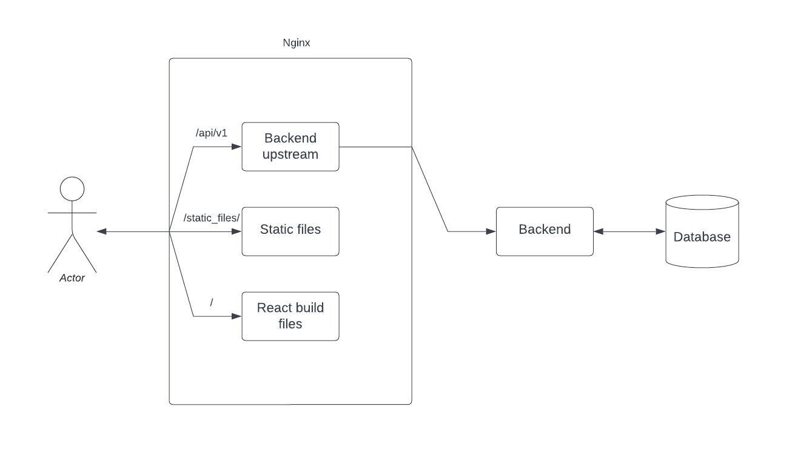
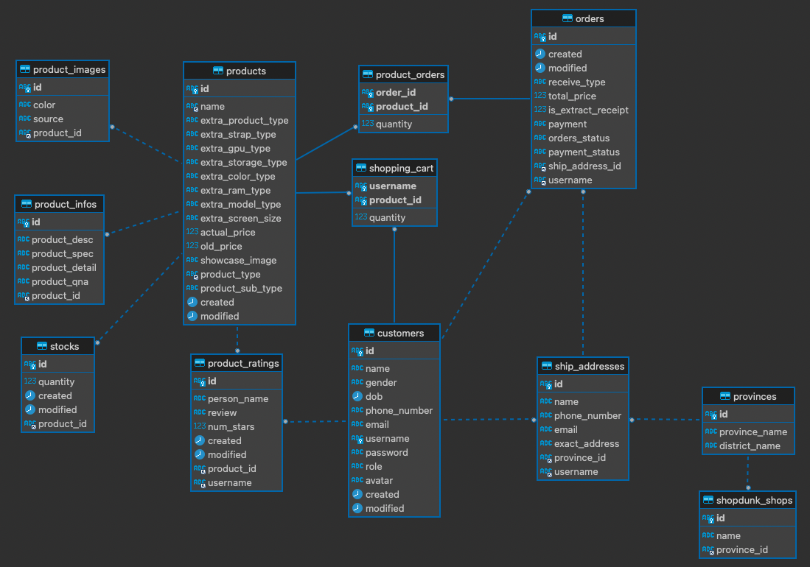

# Shopdunk clone

- Live URL: http://54.255.242.120/

A fullstack ecommerce website with ReactJs, Spring Boot, Nginx, Docker. Data is crawled with Selenium, from: https://shopdunk.com/.

---

### Design architecture



### Database design



#### Project overview

- Backend
  - Spring boot
- Frontend
  - ReactJs (Typescript)
- Database
  - MySQL
- Deployment
  - CI/CD with Github Actions
  - Docker, Docker Compose
- Crawler
  - Selenium

### How to deploy production

```bash
git clone https://github.com/lam1051999/ecommerce_springboot_react.git
cd ecommerce_springboot_react
```

Edit `./nginx/urls/urls_production.js` with your production hosting server url.
Set up Github Actions secret to match your keys.
Commit changes to main branch as it will trigger the Github Actions workflow to build the docker images.
After finishing the build, run the following commands

```bash
bash make_run.sh production
bash make_data.sh
```

### How to deploy locally

Edit `./script/env.sh` to match your keys

```bash
source ./script/env.sh && bash ./script/build.sh development
bash make_run.sh development
```

Go to `http://localhost`
